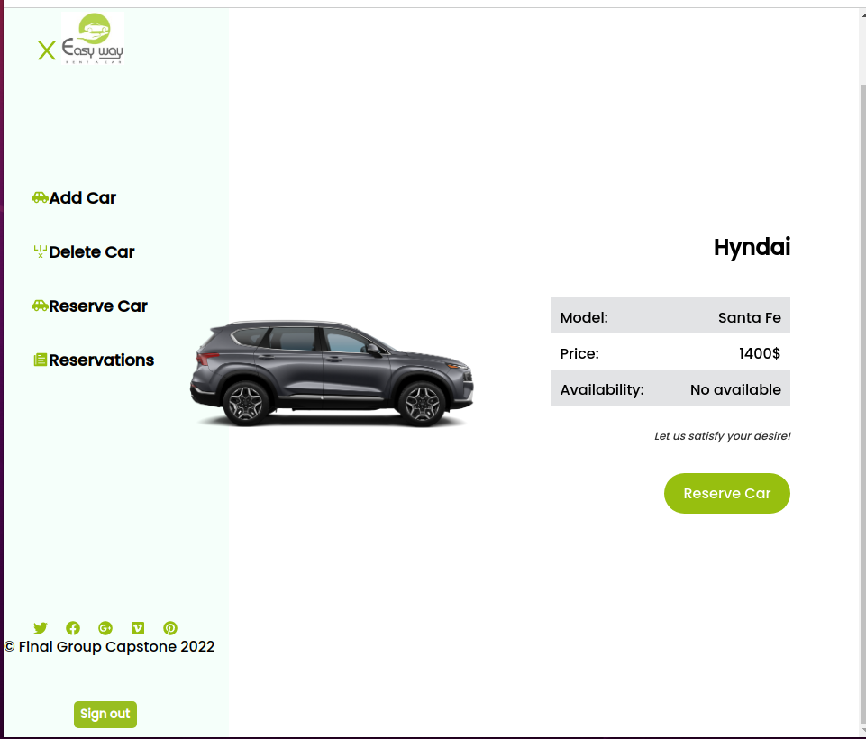

# Rent A Car

<div id="top"></div>
<!-- PROJECT LOGO -->
<div align="center">
  <a href="https://github.com/jerryowusu/final-capstone-frontend">
    
  </a>

  <h1 align="center">Rent A Car </h1>

  <p align="center">
    A car rental website
    <br />

## Back-end Repository Link
<a href="https://github.com/Tobinchilongo/Final-Capstone-BackEnd.git">Book A Car Back-end</a>

</div>


##  Screenshot 1


## Screenshot 2



## Description 🏗️

This is a car rental website that allows you to view a variety of cars and book them at different rates. User can see all models and model details and rerve car. You can also delete the cars you don't want to make space for new ones.

## API link

[Cars](https://agile-peak-14047.herokuapp.com/api/v1/cars) <br>
[Reservations](https://agile-peak-14047.herokuapp.com/api/v1/reservation)
## Live Demo

[car-rentals](https://jcar-rentals.herokuapp.com/)

## Getting Started 🏁

### Clone this repository

```bash
git clone https://github.com/jerryowusu/final-capstone-frontend.git
```
### Move into the cloned directory with

  ```bash
  cd Final-capstone-frontend
  ```

## Setup

Install dependencies with:

  ```bash
  npm install
  ```

### Run linter

```bash
npx eslint .
```

#### Auto-correct

In auto-correct mode, eslint linters offenses will be automatically fixed:

npx eslint . --fix

### Run Project

Start server with:

```bash
npm start
```

## Built With 🔨
<div align="center">

|| Languages ||
|-|-------------|-|
||  ||

</div>

<div align="center">

||Tools 🛠️||
|-|-------------|-|
||       ||
</div>

## Authors ✍️
<div align="center">

| 👤 Tobin Chilongo Jnr|
|---|
| <a target="_blank" href="https://github.com/Tobinchilongo"></a>  <a target="_blank" href="https://www.linkedin.com/in/tobin-chilongo-a6736415a/"></a> <a target="_blank" href="https://twitter.com/Tobin_Official"></a>

| 👤 Candy Inga Cynthia  |
|---|
| <a target="_blank" href="https://github.com/cynthiainga"></a>  <a target="_blank" href="https://www.linkedin.com/in/cynthia-inga/"></a> <a target="_blank" href="https://twitter.com/CynthiaInga_C"></a>

| 👤 Jerry Owusu |
|---|
| <a target="_blank" href="https://github.com/jerryowusu"></a>  <a target="_blank" href="https://linkedin.com/in/jerry-owusu"></a> <a target="_blank" href="https://twitter.com/JerryOwusu"></a>
|

</div>


## 🤝 Contributors

Contributions, issues, and feature requests are greatly appreciated!

If you have a suggestion that would make this better, please fork the repo and create a pull request. You can also simply open an issue with the tag "improvements".

- Fork the Project
- Create your Feature Branch (git checkout -b feature/yourfeaturename)
- Commit your Changes (git commit -m 'Add suggested feature')
- Push to the Branch (git push origin feature/AmazingFeature)
- Open a Pull Request

Feel free to check the [issues page](https://github.com/jerryowusu/final-capstone-frontend/issues).


## 📝 License

This project is licensed by [](LICENSE)

## Show your support 💪
Give a ⭐️ if you like this project!

<p align="right">(<a href="#top">back to top</a>)</p>

## Acknowledgments

- Hat tip to [Murat Korkmaz](https://www.behance.net/gallery/26425031/Vespa-Responsive-Redesign/modules/173005583) for the design idea.

<p align="right">(<a href="#top">back to top</a>)</p>
